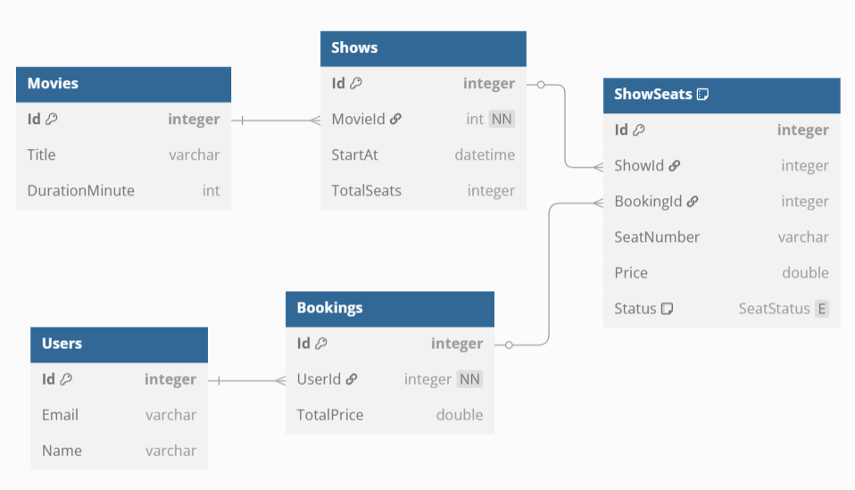
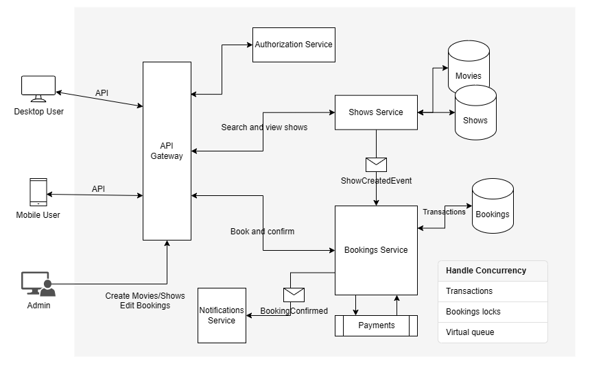

# MovieBookings Exercise

## Features
- NET 8.0
- MinimalAPI with validation
- OpenAPI documentation with Swagger
- EntityFramework with SQLite provider
- Unit tests and integration tests
- Github actions workflow

## Database schema
This is a diagram of the database schema:



For the sake of simplicity there is only one theatre with an hardcoded seats configuration.

## Usage
The database file is already in the repository with some seeded data.  
The default user for login is:
```
{
  "email": "andrea@email.com",
  "password": "password"
}
```

_NB: Only the /api/bookings routes are protected with JWT authentication._

If you want to create a new database file delete the MovieBookings.db and, from the project root folder, run:
```
dotnet ef database update --startup-project .\MovieBookings.API\
```

If the browser is showing error about HTTPS certificates starting the application 
you need to trust the self-signed ASP.NET Core HTTPS on the local machine:
```
dotnet dev-certs https --check --trust
```

## Missing features or improvements
- Global error handling via IExceptionHandler
- Add an admin role that can perform CRUD operations on all shows and bookings
- Extend database model to handle multiple theathers each one with multiple screens
- Show information of what seats were not available after a failed booking request
- Use Result pattern instead of throwing exceptions for domain errors
- Microservices architecture
 
## Microservices architecture
